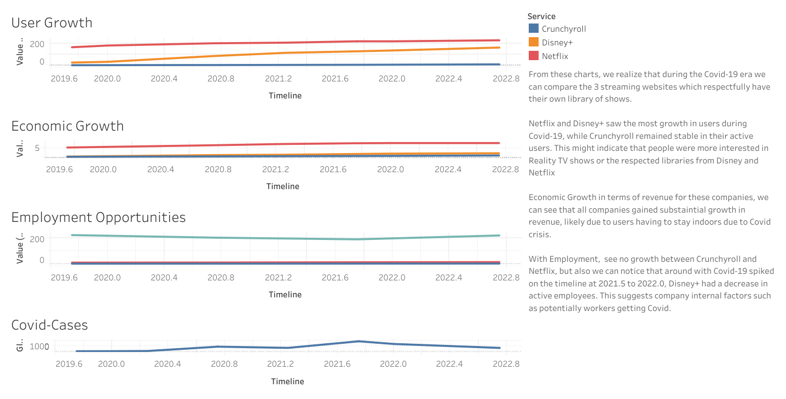

# Andrew_EntertainmentStreamingThingy_2019-2023

## Project Background
The COVID-19 pandemic triggered a massive structural shift in global entertainment consumption. As billions of people faced strict stay-at-home mandates, digital streaming platforms transitioned from an evolutionary entertainment medium into an essential utility. This project examines the financial and operational drivers behind the meteoric rise of streaming giants during the pandemic and evaluates how they managed the subsequent macroeconomic shifts, rising operational costs, and intensifying competition during the post-pandemic "normalization" period.

Rather than simply tracking headline subscriber numbers, this analysis deep-dives into the operational mechanics: how revenue-per-subscriber, total employee footprint, regional growth spikes, and market consolidation drove the strategic trajectories of diverse platforms—ranging from pure-play digital giants (Netflix) and legacy media conglomerates (Disney+) to niche anime platforms (Crunchyroll) from 2019 through 2023.

## Data Sources
All data is sourced directly from official corporate financial reports, public filings, and verified market databases: 

Netflix Investor Relations & Financial Disclosures: 
Netflix Investor Relations Portal - https://ir.netflix.net/financials/annual-reports-and-proxies/default.aspx 
SEC EDGAR Database for Netflix Filings - https://www.sec.gov/edgar/browse/?CIK=1065280 

The Walt Disney Company Earnings & Headcount Data:
Disney Investor Relations Hub: https://thewaltdisneycompany.com/investor-relations/ 
SEC EDGAR Database for Disney Filings: https://www.sec.gov/edgar/browse/?CIK=1744489

Sony Group Corporation (Crunchyroll Acquisition & Metrics):
Group Investor Relations Portal: https://www.sony.com/en/SonyInfo/IR/ 
Sony Pictures Entertainment Press Room: https://www.sonypictures.com/corp/press_releases 

Global COVID-19 Context Baseline:
World Health Organization (WHO) Coronavirus Dashboard: https://covid19.who.int/ 

## Dashboard
 

Dashboard
The dashboard is structured across five analytical sheets to offer a comprehensive view of the streaming ecosystem:

1. Market Share & Volume Growth — Tracking paid subscribers and total revenue across Netflix, Disney+, and Crunchyroll from 2019 to 2023.
2. Macro Trends vs. Subscriptions — Mapping subscriber growth curves directly against global COVID-19 case volumes to isolate pandemic correlation.
3. Operational Footprint Analysis: Evaluating total employee growth trends to see how corporate scaling correlated with revenue expansion.
4. Platform Monetization (ARPU/Efficiency): Monitoring revenue generation efficiency per subscriber across legacy, hybrid, and niche business models.
5. Consolidation & Scale Milestones: Isolating inflection points, such as corporate acquisitions and major policy changes (e.g., password-sharing restrictions).
